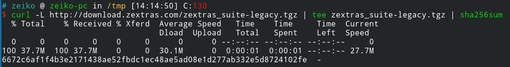

# zextras-legacy

Only use it for really old zimbra version.

Uploaded here has an archive purpose no other commit or issue will be made.

Checksum of the .tgz : 6672c6af1f4b3e2171438ae52fbdc1ec48ae5ad08e1d277ab332e5d8724102fe

Proof of checksum at download :

